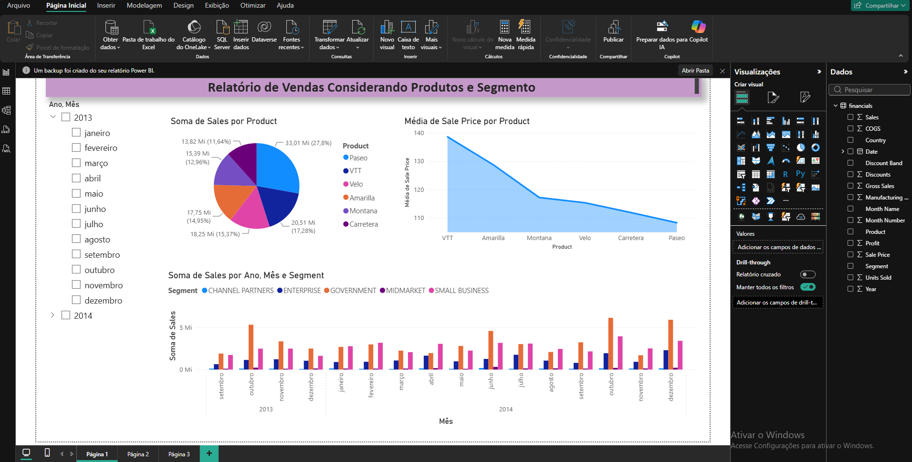
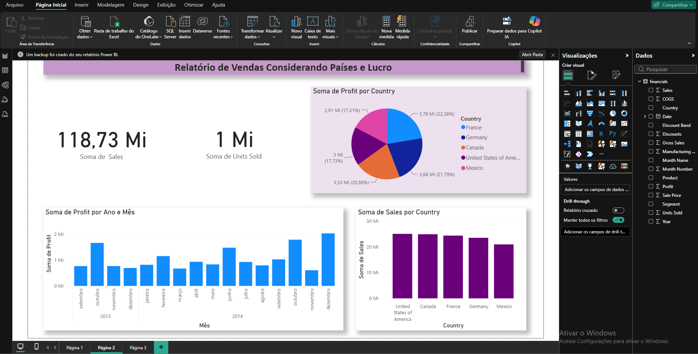
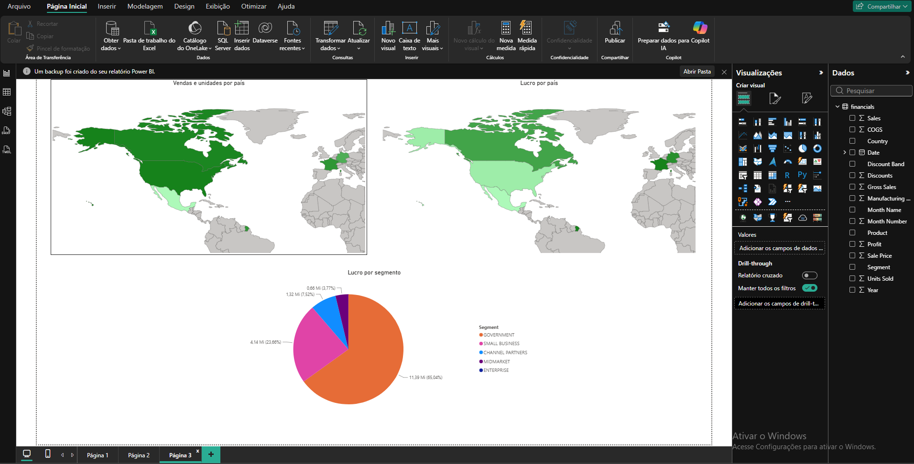

# Relatório Financial Sample no Power BI

Projeto prático do desafio de Power BI da DIO. O objetivo era replicar duas páginas criadas durante o curso com a sample financeira e criar, por conta própria, uma terceira página com mapas e um gráfico de pizza.

## Dados

- Arquivo: [`dados/Financial Sample.xlsx`](dados/Financial%20Sample.xlsx)
- Origem: repositório do curso, [julianazanelatto/power_bi_analyst](https://github.com/julianazanelatto/power_bi_analyst)
- Conteúdo: 700 linhas com segmento, país, produto, unidades vendidas, vendas (Sales), lucro (Profit) e datas.

## Estrutura do repositório

```
dados/        base de dados usada no relatório
relatorio/    arquivo .pbix do projeto
evidencias/   prints das páginas do relatório
README.md     este documento
```

## Páginas do relatório

### Página 1: Relatório de Vendas Considerando Produtos e Segmento (replicada do curso)

- Filtro hierárquico de ano e mês.
- Pizza com a soma de vendas por produto.
- Gráfico de área com a média do preço de venda por produto.
- Gráfico de colunas com a soma de vendas por ano, mês e segmento.



### Página 2: Relatório de Vendas Considerando Países e Lucro (replicada do curso)

- Cartões com a soma de vendas e a soma de unidades vendidas.
- Pizza com a soma de lucro por país.
- Gráfico de colunas com a soma de lucro por ano e mês.
- Gráfico de colunas com a soma de vendas por país.



### Página 3: criada por mim

| Visual | O que mostra | Como foi montado |
|---|---|---|
| Mapa: Vendas e unidades por país | Soma de *Sales* por país, com as unidades vendidas na dica de ferramenta | País em Localização, Sales em Saturação da cor, Units Sold em Dicas de ferramenta |
| Mapa: Lucro por país | Soma de *Profit* por país | País em Localização, Profit em Saturação da cor |
| Pizza: Lucro por segmento | Soma de *Profit* por *Segment* | Segment em Legenda, Profit em Valores |



#### Decisões e observações

- **Mapa de formas em vez de mapa de bolhas.** Os visuais de mapa padrão do Power BI estavam bloqueados na organização da conta que usei. Como alternativa, usei o **mapa de formas** com um mapa-múndi personalizado (TopoJSON de países). Por isso os valores são mostrados pela intensidade da cor, e não pelo tamanho das bolhas.
- **Pizza sem o segmento Enterprise.** O lucro do segmento Enterprise é negativo na base, e o gráfico de pizza não desenha valores negativos. Ele aparece na legenda, mas sem fatia, e os percentuais são calculados sobre os segmentos com lucro positivo.

### Ajustes feitos

- Disposição dos visuais conferida e alinhada, com os mapas lado a lado e a pizza centralizada embaixo.
- Títulos dos visuais renomeados para nomes claros e diretos.
- Campos das dicas de ferramentas revisados: o mapa de vendas mostra também as unidades vendidas.

## Publicação

- O relatório não foi publicado no Power BI Service. O projeto foi salvo como arquivo `.pbix`, disponível em [`relatorio/`](relatorio/).
- Como não tenho o PowerPoint, não compartilhei como suplemento. Seguindo a orientação do desafio, salvei o projeto de Power BI.

## Ferramentas

- Power BI Desktop
- GitHub

## O que aprendi

- Montar relatórios com várias páginas a partir de uma mesma base de dados.
- Criar visuais de mapa e de pizza e escolher os campos certos para cada um.
- Contornar uma limitação do ambiente (mapas bloqueados) usando o mapa de formas com um mapa personalizado.
- Usar as dicas de ferramentas para mostrar informações extras sem poluir o visual.
